# LinguaDesk · Software localization and translation collaboration

[中文](README.md) | [English](README.en.md)


**ZhiHua Technology (Shanghai Rujing Zhihua Information Technology Co., Ltd.)** · [Website](https://www.zhuatech.cn/)

LinguaDesk is a self-hostable string workspace for small software teams, independent app developers and software-localization contributors. Import interface JSON, assign a translator, edit and independently review each string, then freeze locale files that future edits cannot overwrite. Java 21 / Spring Boot / MySQL backend and Vue 3 frontend. Public source for non-commercial use; commercial use requires written authorization.

It addresses missing translations, lost placeholders and mismatched review/delivery versions across spreadsheets and chat files. Each project has one target locale; manage multiple projects for different locale pairs. Rules assist people and cannot establish semantic correctness. No machine translation or external model submission is implemented.

## Source → translation → review → delivery

Create manager, translator and independent reviewer accounts. A manager creates the project, imports flat JSON, sets context/length limits and drafts a glossary. Import validates first and commits atomically; duplicate or invalid keys reject the whole batch. The assigned translator saves drafts or submits exact versions, optionally applying manually selected exact approved matches from visible projects in the same team and locale pair. The assigned reviewer approves or returns with comments.

Empty targets, placeholder names/counts and exceeded character limits block approval. Differing numbers, missing literal terms and identical source/target text require an explicit reviewer explanation. All current strings must pass independent review before releasing JSON and bilingual CSV. Source/translation changes invalidate that string's approval; old deliveries remain unchanged. Re-review and release updated content before closing.

| Implemented area | Behavior and boundaries |
|---|---|
| Projects | Create, edit due date/assignments, draft/start/pause/resume/close/cancel with reason; fixed team/locale pair |
| Strings | Flat JSON file/paste import, preview, merge/replace, individual source/context/length edits and archives, search/status filters |
| Translation & review | Save/submit/return/approve, version conflicts, placeholder/length blockers, number/term warnings, independent identities and no self-approval |
| Glossary | Draft CRUD, frozen after start, case-sensitive literal matching |
| History & files | Full current-string revisions, project events, immutable historical JSON/CSV, SHA-256 and authenticated downloads |
| Contributor UI | My translations, review queue, mobile layout, Chinese/English UI; no automated translation |
| Administration | Accounts, BCrypt12, resets/self password changes, roles, permissions, teams, menus, platform dictionary, parameters and last full administrator protection |
| Data scopes | ALL / DEPARTMENT / ASSIGNED, live identity and permission checks; assignment restrictions also apply to administrators |
| Operations | Real scoped project totals, pagination/sorting, reports/CSV, read-only audit, health, consistent bundled-DB backup and isolated restore |

## Running screens

Screens show an isolated TEST instance with clearly marked test projects/people. They contain no customer material or passwords. A fresh installation contains no such business records.

### Sign-in

Instance-managed accounts; no shared passwords.

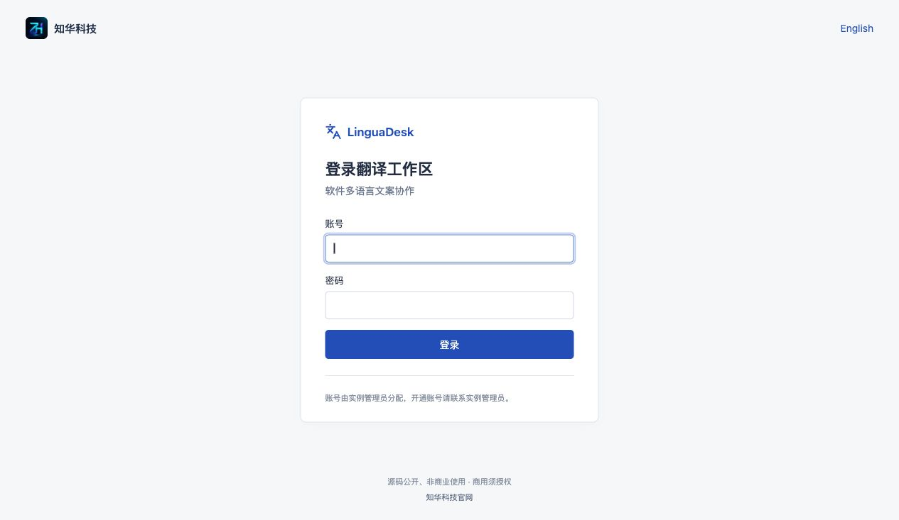

### Projects and progress

Real project, string and approval totals, with filtering and pagination.

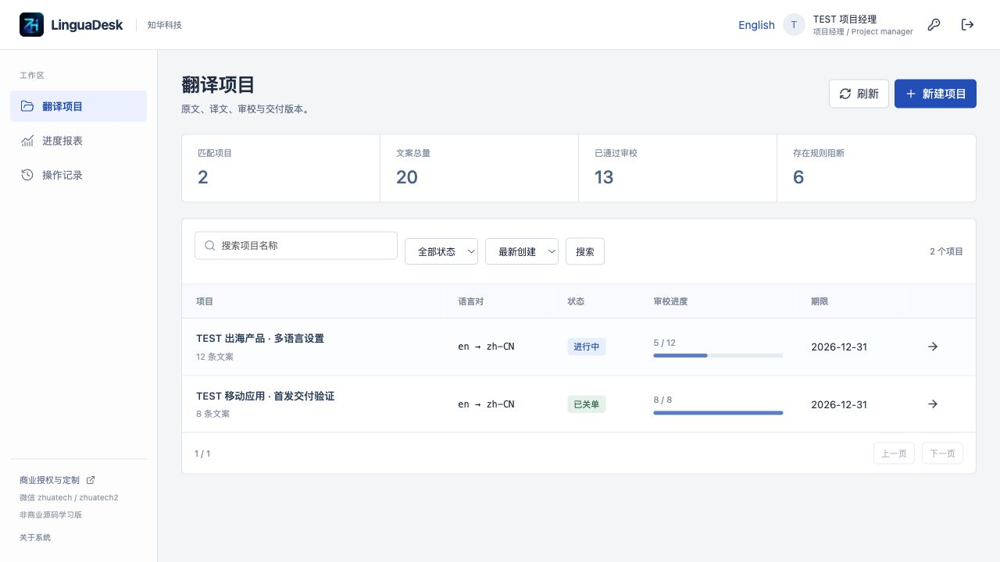

### Translator workbench

Source, context, character limits, submission and revision history.

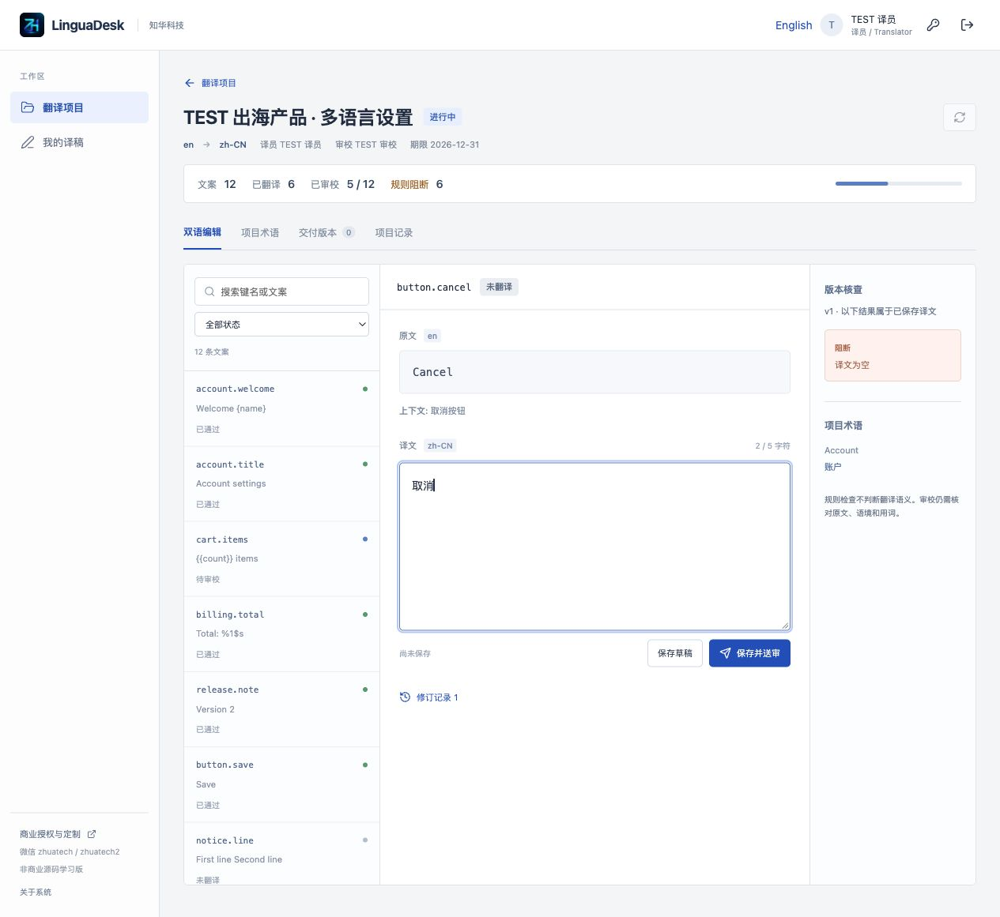

### Independent review

Assigned review of the exact submitted version; placeholder and length blockers cannot be waived.

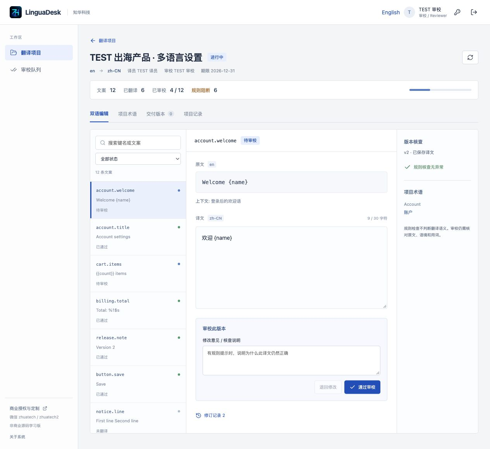

### JSON file import

Read a real file, validate and preview additions/changes/archives before importing.

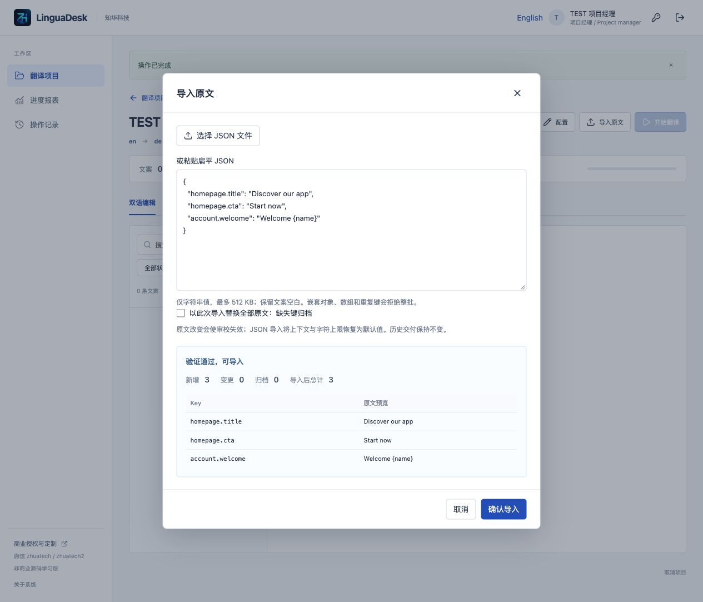

### Project glossary

Manage explicit source/target terms; freeze them once started.

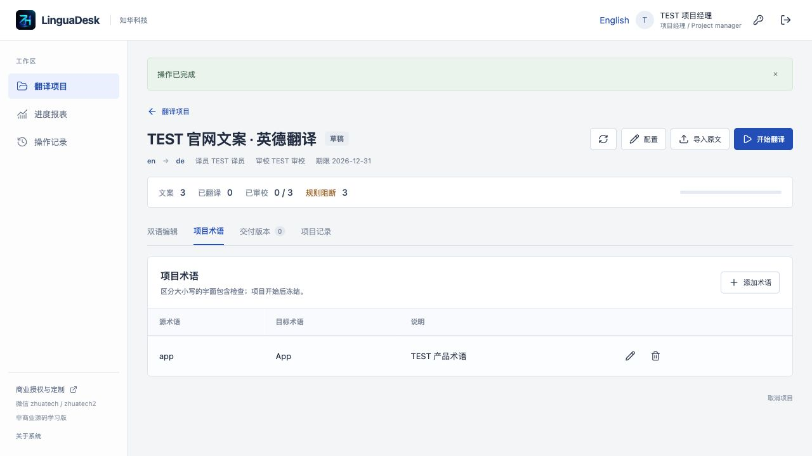

### Frozen deliveries

Historical JSON and bilingual CSV deliveries with verifiable SHA-256.

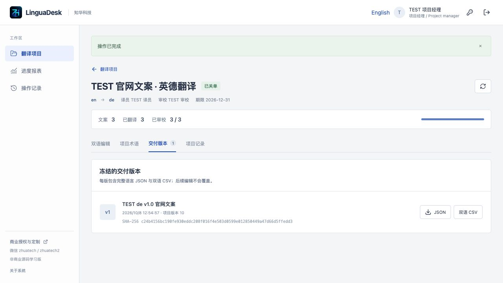

### Account administration

Real identities, teams, roles, enabled status and password reset.

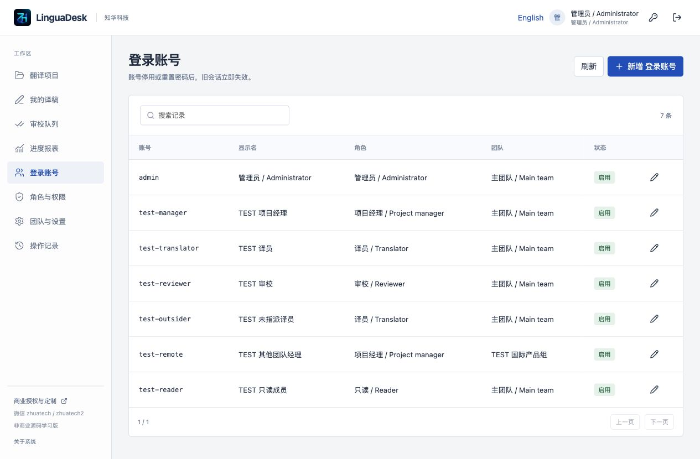

### Roles and permissions

Server-enforced permissions, team and assignment scopes.

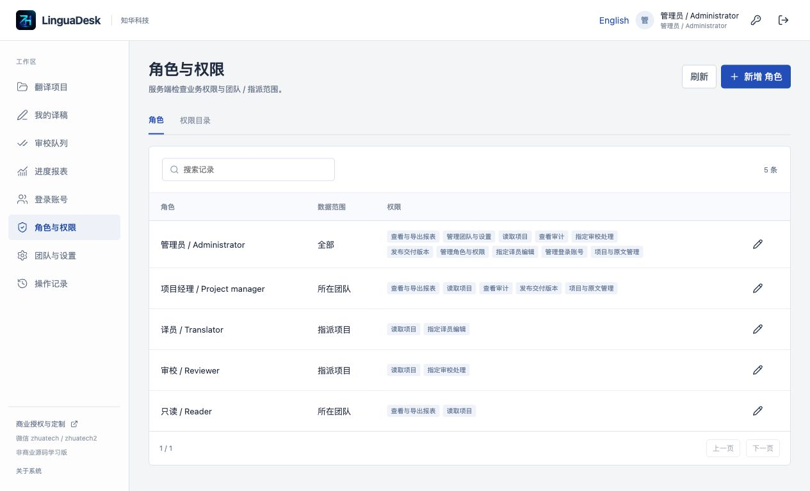

### Teams and parameters

Manage IANA time zones, platforms, menus and instance limits.

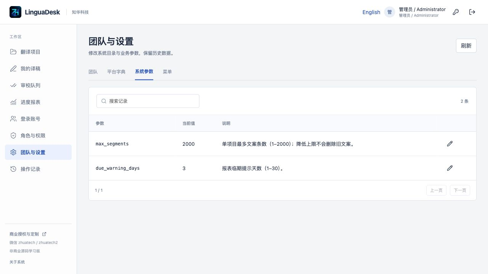

### Progress reports

Scoped translation, approval, rule issues, dates and CSV export.

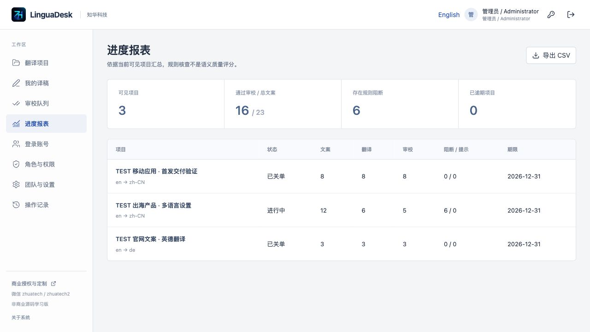

### Audit trail

Persisted account and business actions without credentials.

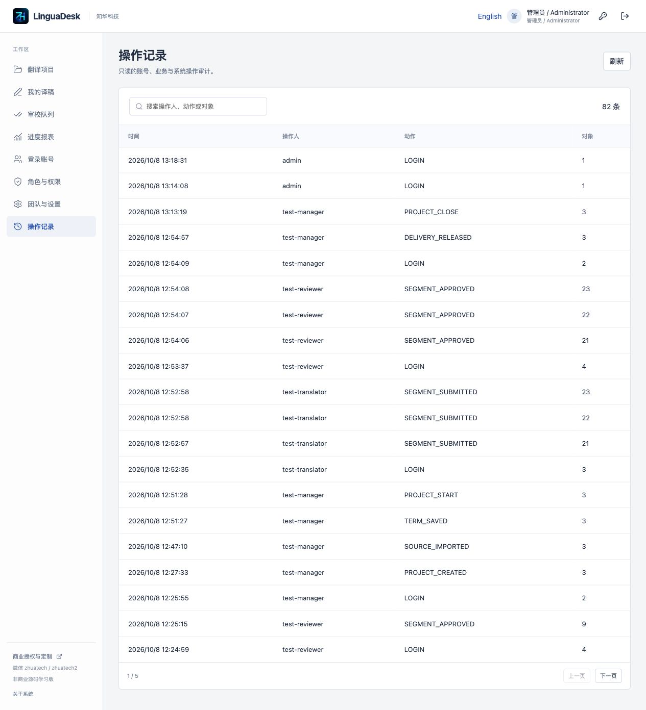

### Mobile interface

Narrow-screen navigation, string list and editor.

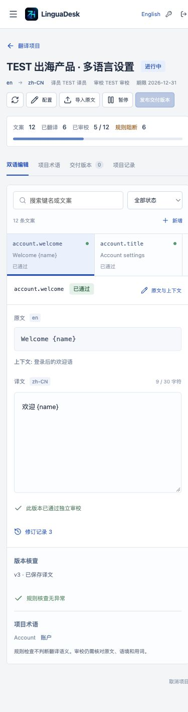

### English workspace

The same business workflow and permissions with English UI.

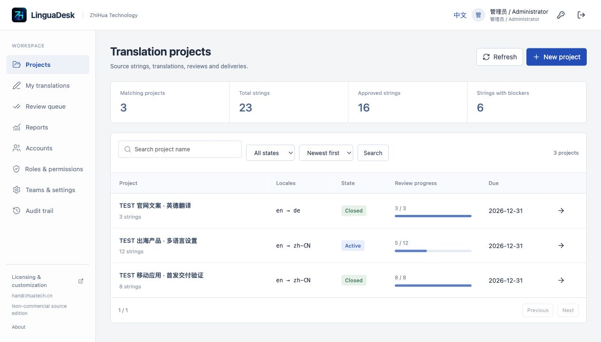

## Architecture and layout

Browser → same-origin Nginx → Spring Boot / Security / JPA → MySQL / Flyway. Accounts and business content come from the database. Pinned versions: Spring Boot 4.0.7, Vue 3.5.40, Vite 8.1.5, Node 24.19.0, MySQL 8.4, Maven 3.9 / Java 21. Metadata and lockfiles are authoritative.

```text
backend/              Java services, authentication, domain, directories and tests
  src/main/resources/db/migration/V1__lingua_schema.sql
frontend/             Vue UI, Chinese/English copy, Nginx and tests
docs/                 Architecture, API, deployment, security, guide and screenshots
scripts/              Environment setup, HTTP QA, backup/restore and release checks
compose.yaml          Bundled MySQL, backend and Nginx frontend
.env.example          Configuration names without credentials
LICENSE               Non-commercial source license
```

15 application tables plus Flyway history cover identities/directories, projects, segments, terms, immutable revisions/events and frozen files. V1 creates schema, foreign keys and indexes. V2 preserves literal accented glossary distinctions without overwriting records. Bootstrap creates directories and a private administrator only. No fabricated production seed; Hibernate validates schema rather than creating it around migrations.

## Installation and initial accounts

Docker / Compose v2 with `--wait`, network access to official dependencies, and Python 3.11+ for environment setup. Separate development also needs Java 21 / Maven 3.9, Node 24.19.0 or a compatible newer version, and MySQL 8.

```bash
python3 scripts/init-env.py
docker compose -p linguadesk up -d --build --wait --wait-timeout 180
```

Open [local workspace](http://127.0.0.1:8126/) and [health](http://127.0.0.1:8126/actuator/health). Initial username defaults to `admin` through ADMIN_USERNAME; use the private ADMIN_PASSWORD from your local `.env`. The setup generates independent strong passwords in a 0600 file and refuses overwrite. **No shared public default password.** Existing accounts are never reset by restart or changing `.env`; use account administration. Create separate translator/reviewer accounts before starting work.

Compose supplies an independent database volume; no existing local database required. Flyway initializes automatically. Back up before upgrades and use new migration versions without modifying an applied V1. Never upgrade with `down -v`. Fresh installation, the V1→V2 literal-glossary migration and same-version restart are validated; historical-version migration coverage is not claimed.

For separate local development, Spring Boot does not automatically read `.env`; privately export `.env.example` variables to the current process and point DATABASE_URL/USER/PASSWORD at your own MySQL; `mvn -f backend/pom.xml spring-boot:run`, then `npm ci && npm run dev` inside frontend. Vite defaults to 5173 and proxies `/api` to127.0.0.1:8080. Never commit real environment files.

## Configuration, deployment and recovery

| Variable | Meaning |
|---|---|
| MYSQL_ROOT_PASSWORD / DATABASE_PASSWORD | Independent bundled-database passwords |
| ADMIN_USERNAME / ADMIN_PASSWORD | First bootstrap only; manage existing accounts through UI |
| WEB_PORT / BIND_ADDRESS | 8126 / 127.0.0.1 by default; MySQL/backend not published |
| COOKIE_SECURE | false for local HTTP; true behind trusted HTTPS proxy |
| DATABASE_URL / DATABASE_USER | Optional external MySQL; trusted TLS and VERIFY_IDENTITY required |

Parameters: max_segments=2000 (1–2000), due_warning_days=3 (1–30). Due/overdue dates follow each project's IANA team time zone. Source/target maximum 4000 UTF-16 units; the per-string target limit counts Unicode code points. Flat JSON import maximum 512000 bytes. Stable keys accept ASCII letters/digits and `_ . : / -`; case-only duplicate keys are rejected. Menu/permission/parameter codes are fixed directories, not arbitrary new routes or executable scripts.

Detailed [operations guide](docs/operations.md), [deployment/recovery](docs/deployment.md), [API](docs/api.md), [architecture](docs/architecture.md) and [security](docs/security.md) are available in Chinese. This README and UI provide the corresponding English workflow and boundaries. Public or real commercial deployment requires authorization and your own TLS, backup, monitoring and security assessment; production acceptance is not claimed.

```bash
python3 scripts/backup.py --project linguadesk --output private-backups/linguadesk.zip
# Use a private separate restore env with another port and localhost binding.
python3 scripts/restore.py private-backups/linguadesk.zip --project linguadesk-recovery --env-file /absolute/private/recovery.env
```

Backup briefly stops only the named backend, then resumes it after a consistent bundled-MySQL dump. Private ZIP includes content and password hashes, so protect/encrypt it and never upload it to source hosting. Restore verifies members, product, sizes and SHA, refuses existing resources and accepts SQL up to512 MiB. Only restore trusted self-created backups: checksums are not signatures and SQL is not sandboxed. These scripts support the bundled database only.

## Tests and verification

```bash
mvn -B -f backend/pom.xml spotless:check test package
npm --prefix frontend ci --no-audit --no-fund
npm --prefix frontend run format:check
npm --prefix frontend run lint
npm --prefix frontend test
npm --prefix frontend run build
```

Backend tests use real HTTP/JPA/Flyway plus text-rule counterexamples. Frontend checks CSRF, no write replay after failure, UTF-8, downloads and filtering. Docker builds run tests without skipping. Full workflow QA creates clearly marked TEST accounts/content in an **empty disposable localhost instance**, rejecting nonlocal targets and nonempty project databases.

```bash
python3 -m venv .venv
.venv/bin/python -m pip install -r scripts/requirements-quality.txt
.venv/bin/python scripts/quality.py --base http://127.0.0.1:8126
.venv/bin/python scripts/verify-persistence.py --base http://127.0.0.1:8126 --state output/quality-state.json
python3 scripts/release-check.py
docker compose config --quiet
git diff --check
```

QA stores private state; never use it against real business data. After additional GUI changes, `--refresh-snapshot` updates the private baseline before restart/restore comparisons. Verification checks exact delivery SHA and prior audit rows; HTTP200 alone does not prove a workflow complete. Also manually exercise create→import→translate→review→release→download and your required narrow-screen device.

Troubleshooting: build download failures need network/log inspection. Inspect backend/MySQL logs for health failures; do not delete volumes. For401 sign in again;403 check role/team/assignment;409 check state/latest version and refresh before deciding to repeat. Empty files, duplicate keys and nested JSON do not import. Source changes invalidating approvals are deliberate version protection. A disconnected write has unknown outcome: read the record before resubmitting.

## Limits, license and feedback

Small-team single-instance source; no external user or sales validation claimed. No machine translation, SSO/MFA, email recovery, repository Git/CI integration, notifications, payments or cloud storage; no API keys required for these unimplemented features. No load/penetration testing, SaaS tenant isolation or production guarantee. A global write lock, bounded in-memory summaries and10000-row guard limit scale. Revision history grows and needs capacity/access planning.

Flat JSON and explicit row input only. No nested JSON, arrays, XLIFF, DOCX, PDF, subtitles, complete ICU plural/gender rules or every printf format. Literal terms and numeric locale formats can produce warnings; people judge meaning and unsupported formatting. CSV formula escaping changes formula prefixes; JSON is the exact programmatic delivery. Unimplemented integrations must not be described as completed configurable features.

Self-owned code follows [LICENSE](LICENSE): personal learning, research and non-commercial exchange only. Commercial/internal real-business use, paid deployment, SaaS, resale, commercial delivery and customization require written authorization from Shanghai Rujing Zhihua Information Technology Co., Ltd. This is public source with non-commercial use restrictions, not an OSI open-source license. Third-party dependencies retain their own copyrights/licenses. Software is supplied as-is without production suitability guarantees.

Contribute small, reproducible improvements with versions, steps, expectations and sanitized evidence; retain attribution/license and run tests. Do not post passwords, real business strings or backups. Report vulnerabilities privately through the website or the contacts below before public exploit details.

## Contact ZhiHua Technology

For commercial licensing, private deployment, system integration and custom development:

- **ZhiHua Technology (Shanghai Rujing Zhihua Information Technology Co., Ltd.)**
- Website: [https://www.zhuatech.cn/](https://www.zhuatech.cn/)
- Email: [han@zhuatech.cn](mailto:han@zhuatech.cn)
- Email: [jack@zhuatech.cn](mailto:jack@zhuatech.cn)
- WhatsApp: [+86 17521234993](https://wa.me/8617521234993)

ZhiHua Technology supplies this public source edition for personal learning, research and non-commercial exchange. Commercial use requires written authorization. For enterprise information systems, SME digital/AI transformation, private deployment, software outsourcing, implementation, FDE outsourcing, OPC technical support and extensive customization, visit the official website or use the email/WhatsApp contacts above.
